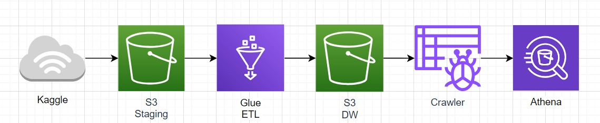

# Introdução

Olá a todos!\
Após passar algumas horas estudando sobre Serviços da AWS, resolvi ir atrás de alguns projetos para começar a mostrar o que tenho trilhado nessa jornada. \
Projeto foi criado a partir dos videos do canal Date with Data e com a ajuda de alguns amigos. Construi um projeto de engenharia de dados completo do início ao fim, utilizando a AWS Cloud.

## Ferramentas utilizadas

## Objetivo
Conforme você pode observar no diagrama, os dados inicialmente residirão em nossa camada de staging. Em seguida, utilizaremos o AWS Glue para construir nosso pipeline ETL. Esse pipeline extrairá os dados da camada de staging e os transferirá para nosso data warehouse.

Uma vez configurado nosso data warehouse, executaremos um Glue Crawler. Esse crawler criará automaticamente um banco de dados e populá-lo-á com uma tabela para nossos dados.

Por fim, utilizaremos o Amazon Athena para consultar os dados armazenados em nossa tabela.

### Objetivo pessoal
O trabalho em questão é executado com o propósito de estudo e aprimoramento pessoal. Com interesse em aprofundar meu entendimento sobre o assunto e as ferramentas que são utilizadas, e,  a desenvolver minhas habilidades e competências 

